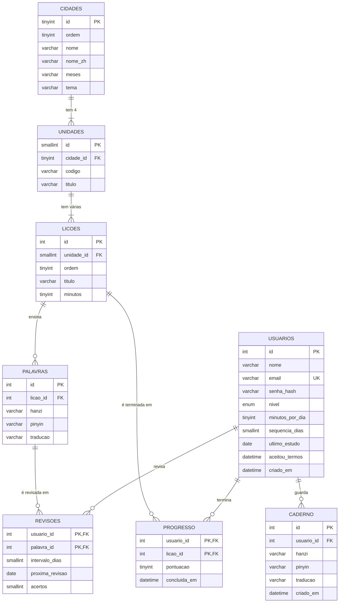

# Chá · Base de dados

> Versão 1 (28/09/2026). O script está em `base_de_dados/cha.sql`.

## Como eu importo no phpMyAdmin (XAMPP)

1. Abro o **XAMPP Control Panel** e clico em **Start** no **Apache** e no **MySQL**.
2. Abro o navegador em `http://localhost/phpmyadmin`.
3. Clico na aba **Importar** (no topo, sem escolher nenhuma base à esquerda).
4. Em **Arquivo a importar**, escolho `base_de_dados/cha.sql`. O conjunto de caracteres deve ficar em **utf-8**.
5. Clico em **Importar** (ou **Executar**) no fim da página.
6. À esquerda aparece a base **cha** com 8 tabelas. Na aba **Designer** eu vejo o diagrama com as ligações.

O script começa com `DROP DATABASE IF EXISTS cha`, por isso eu posso importar de novo sempre que mudar alguma coisa. **Atenção:** isso apaga os dados que já estavam na base.

## Diagrama entidade-relação

## As tabelas em uma frase

| Tabela | O que eu guardo |
|---|---|
| `usuarios` | Quem tem conta: nome, e-mail, senha (só o hash), nível, meta diária e streak |
| `cidades` | As 6 cidades da rota |
| `unidades` | As 24 unidades (4 por cidade) |
| `licoes` | As lições de cada unidade |
| `palavras` | O vocabulário, com hanzi, pinyin e tradução |
| `progresso` | Que lições cada usuário já terminou, e com que pontuação |
| `revisoes` | Quando cada usuário deve revisar cada palavra (revisão espaçada) |
| `caderno` | As palavras que cada usuário guardou no caderno pessoal |

## Decisões que eu tomei (e por quê)

- **utf8mb4 + `SET NAMES utf8mb4`:** sem isso os caracteres chineses ficam embaralhados. Eu testei: sem a linha `SET NAMES`, 葡萄牙人 aparecia como `è‘¡è„牙人`.
- **Senha só como hash:** o PHP cria o hash com `password_hash()` e confere com `password_verify()`. Nem eu consigo ver a senha de ninguém (UC00613).
- **Chave primária dupla em `progresso` e `revisoes`:** a combinação usuário + lição (ou usuário + palavra) só pode existir uma vez. É assim que eu represento uma relação N:N.
- **`ON DELETE CASCADE`:** se um usuário apagar a conta, o progresso, as revisões e o caderno dele também são apagados. Isso cumpre o direito ao apagamento do RGPD (art. 17.º).
- **`aceitou_termos`:** eu guardo quando o usuário aceitou a política de privacidade, para provar o consentimento (RGPD, art. 7.º).
- **Não crio usuários de exemplo no SQL:** o hash da senha tem de ser feito pelo PHP, por isso os usuários nascem na página de registro.
- **Conquistas (badges) ficaram de fora nesta versão**, para a base ficar pequena. Posso adicioná-las depois com mais duas tabelas.

## Testes que eu fiz (MariaDB 10.11, a mesma do XAMPP)

- O script importa sem erros e cria as 8 tabelas, as 6 cidades, as 24 unidades, 6 lições e 16 palavras.
- O mesmo usuário não consegue terminar a mesma lição duas vezes (a chave primária bloqueia).
- Não dá para criar uma lição numa unidade que não existe (a chave estrangeira bloqueia).
- Ao apagar um usuário, o progresso, as revisões e o caderno dele somem juntos.
- O PHP (PDO com `charset=utf8mb4`) lê os caracteres chineses corretamente.
