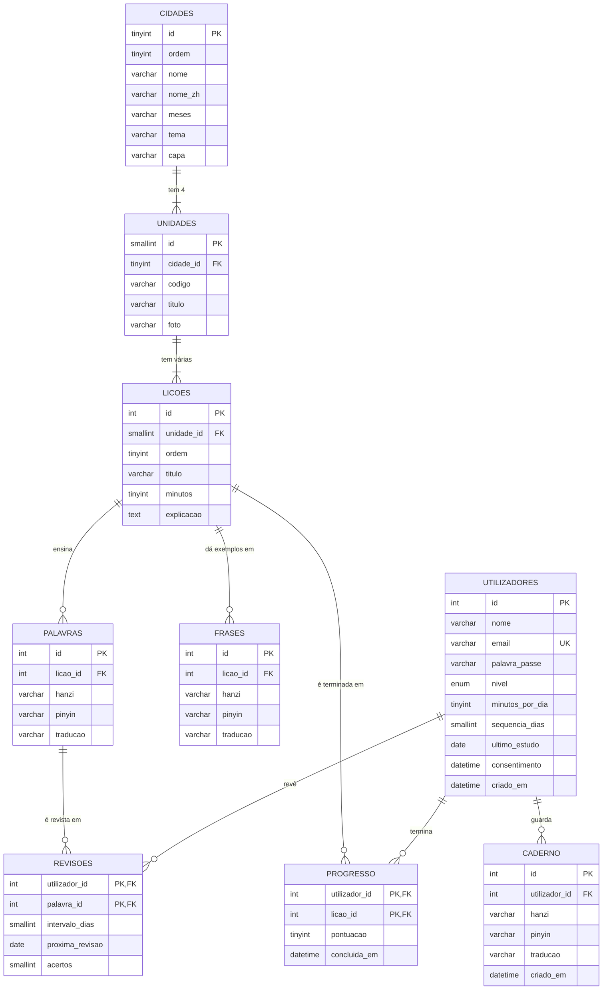

# Chá · Base de dados

> Versão 1 (28/09/2026). O script está em `base_de_dados/cha.sql`.

## Como importo no phpMyAdmin (XAMPP)

1. Abro o **XAMPP Control Panel** e clico em **Start** no **Apache** e no **MySQL**.
2. Abro o browser em `http://localhost/phpmyadmin`.
3. Clico no separador **Importar** (no topo, sem escolher nenhuma base à esquerda).
4. Em **Ficheiro a importar**, escolho `base_de_dados/cha.sql`. O conjunto de caracteres deve ficar em **utf-8**.
5. Clico em **Importar** (ou **Executar**) no fim da página.
6. À esquerda aparece a base **cha** com 9 tabelas. No separador **Designer** vejo o diagrama com as ligações.

O script começa com `DROP DATABASE IF EXISTS cha`, por isso posso importar de novo sempre que mudar alguma coisa. **Atenção:** isso apaga os dados que já estavam na base.

## Diagrama entidade-relação

## As tabelas em uma frase

| Tabela | O que eu guardo |
|---|---|
| `utilizadores` | Quem tem conta: nome, e-mail, palavra-passe (só o hash), nível, meta diária e dias seguidos a estudar |
| `cidades` | As 6 cidades da rota, com o nome da foto de capa |
| `unidades` | As 24 unidades (4 por cidade), com o nome da foto de cada uma |
| `licoes` | As lições de cada unidade, com uma explicação curta do tema |
| `palavras` | O vocabulário, com hanzi, pinyin e tradução |
| `frases` | As frases de exemplo de cada lição, também com hanzi, pinyin e tradução |
| `progresso` | Que lições cada utilizador já terminou, e com que pontuação |
| `revisoes` | Quando cada utilizador deve rever cada palavra (revisão espaçada) |
| `caderno` | As palavras que cada utilizador guardou no caderno pessoal |

## Decisões que tomei (e porquê)

- **utf8mb4 + `SET NAMES utf8mb4`:** sem isso os caracteres chineses ficam embaralhados. Testei: sem a linha `SET NAMES`, 葡萄牙人 aparecia como `è‘¡è„牙人`.
- **Palavra-passe só como hash:** o PHP cria o hash com `password_hash()` e confirma-o com `password_verify()`. Nem eu consigo ver a palavra-passe de ninguém (UC00613).
- **Chave primária dupla em `progresso` e `revisoes`:** a combinação utilizador + lição (ou utilizador + palavra) só pode existir uma vez. É assim que represento uma relação N:N.
- **`ON DELETE CASCADE`:** se um utilizador eliminar a conta, o progresso, as revisões e o caderno dele também são apagados. Isso cumpre o direito ao apagamento do RGPD (art. 17.º).
- **`consentimento`:** guardo quando o utilizador aceitou a política de privacidade, para provar o consentimento (RGPD, art. 7.º).
- **Não crio utilizadores de exemplo no SQL:** o hash da palavra-passe tem de ser feito pelo PHP, por isso os utilizadores nascem na página de registo.
- **Conquistas (badges) ficaram de fora nesta versão**, para a base ficar pequena. Posso adicioná-las depois com mais duas tabelas.

## Testes que fiz (MariaDB 10.11, a mesma do XAMPP)

- O script importa sem erros e cria as 9 tabelas, as 6 cidades, as 24 unidades e as 12 lições de Pequim (3 por unidade), com 90 palavras e 36 frases.
- O mesmo utilizador não consegue terminar a mesma lição duas vezes (a chave primária bloqueia).
- Não dá para criar uma lição numa unidade que não existe (a chave estrangeira bloqueia).
- Ao eliminar um utilizador, o progresso, as revisões e o caderno dele somem juntos.
- O PHP (PDO com `charset=utf8mb4`) lê os caracteres chineses corretamente.

## Ficheiros PHP que usam esta base

| Ficheiro | O que faz |
|---|---|
| `index.php` | Página inicial: hero, painel do aluno e a rota das 6 cidades com o progresso de cada uma (consulta com `LEFT JOIN` e `GROUP BY`) |
| `cidade.php?id=` | Página de uma cidade: capa, as 4 unidades com a foto e as lições, marcando as que o aluno já fez |
| `licao.php?id=` | Página de uma lição: explicação, palavras novas e frases de exemplo com áudio, e o botão "Concluir lição" |
| `concluir-licao.php` | Grava a lição no progresso, põe as palavras nas revisões para o dia seguinte e atualiza os dias seguidos |
| `includes/navegacao.php` e `includes/scripts.php` | A barra de navegação e o JavaScript partilhados pelas páginas PHP |
| `includes/ligacao.php` | Liga o PHP à base `cha` com PDO e `charset=utf8mb4` |
| `includes/sessao.php` | Inicia a sessão e tem as funções `exigir_sessao()`, `iniciar_sessao()`, `token_csrf()`, `validar_csrf()` e `e()` |
| `registo.php` | Cria a conta (valida os dados, confirma a idade mínima e o consentimento) |
| `entrar.php` | Inicia sessão |
| `conta.php` | Mostra "A minha conta" |
| `sair.php` | Termina a sessão (só por POST) |
| `eliminar-conta.php` | Elimina a conta e, em cascata, todos os dados do utilizador |
| `privacidade.php` | Política de Privacidade (tem campos entre `[ ]` para preencher antes de publicar) |

Para testar no XAMPP, copio a pasta `mandarin_project` para `C:\xampp\htdocs\cha` e abro `http://localhost/cha/`. O Apache abre o `index.php` sozinho.
